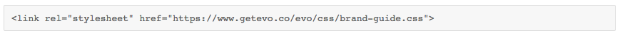
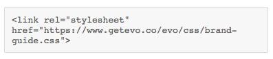
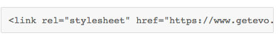
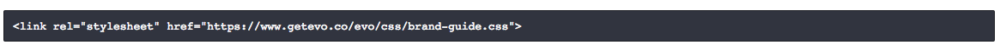

# evo - inline code block

## Summary
Code samples for an inline code block with four different styles: text wrap on light background with 100% width, scrolling on light background with 100% width, scrolling on light background and only as wide as the text requires, text wrap on dark background with 100% width. 

## Setup
* Add the reference to the stylesheet and set it's pathway.
* copy and paste html for the style of inline code block that you want, or just take the basic html block and add the classes listed below to achieve the desired behavior.
    * Adding the class "nowrap" to the code line removes text wrapping. The box then scrolls.
    * Adding the class "short" to the code line removes the 100% width.
    * Adding the class "darktheme" to the code line darkens the background.

## Structure
####index.html
>This file contains the code examples, can copy and paste examples right from here and add the text inside you want.

####style.css / style.scss
>The style.css is the compiled output of the style.scss file and contains the styles for the codeblocks.

## Screenshot

class="nowrap" 

class="short"

class="darktheme"

class="darktheme short"

